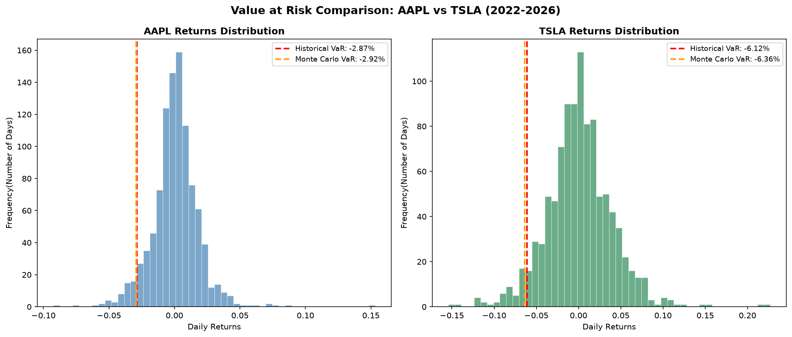

# Value at Risk (VaR) Model — AAPL vs TSLA

## Overview
This project builds a Value at Risk (VaR) model in Python to estimate and 
compare the daily risk of a $10,000 investment in two stocks with very 
different volatility profiles: Apple (AAPL) and Tesla (TSLA). The model 
uses four years of real market data (2022–2026) and applies two estimation 
methods — Historical Simulation and Monte Carlo Simulation — then validates 
the results through backtesting.

## What is Value at Risk?
A 95% confidence VaR of $287 means: on 95% of trading days, losses will 
not exceed $287. On the worst 5% of days — roughly 12–13 trading days per 
year — losses are expected to exceed that threshold. This is one of the 
most widely used risk metrics in finance, reported by major banks 
(including Goldman Sachs) in quarterly earnings and used across trading 
desks, asset managers, and regulators to size risk exposure.

## Methodology

### 1. Historical VaR
Uses real daily returns from each stock's price history to find the 
actual 5th percentile of historical losses. No distributional assumptions 
are made — this method reflects what genuinely happened in the market.

### 2. Monte Carlo VaR
Generates 10,000 simulated daily returns drawn from a normal distribution, 
parameterized by each stock's real historical mean return and standard 
deviation. The 5th percentile of the simulated distribution becomes the 
risk estimate. This method assumes returns are normally distributed.

## Results

### Risk Comparison

| Metric | AAPL | TSLA |
|---|---|---|
| Daily Volatility (Std Dev) | 1.80% | 3.89% |
| Historical VaR (95%) | $287.39 | $611.51 |
| Monte Carlo VaR (95%) | $291.54 | $635.79 |
| Historical vs. Monte Carlo Gap | $4.15 | $24.28 |

## Key Insights

**Volatility drives the gap between methods.** Tesla's volatility 
(3.89%) is roughly double Apple's (1.80%), but the gap between its 
Historical and Monte Carlo VaR estimates is nearly six times larger 
($24.28 vs. $4.15). This suggests the normal distribution assumption 
underlying Monte Carlo simulation breaks down more severely for 
higher-volatility stocks — their actual return distributions likely 
exhibit fatter tails than a standard normal distribution predicts, a 
well-documented phenomenon in equity markets.

## Limitations
- VaR estimates the threshold of loss but does not predict the magnitude 
  of losses beyond that threshold (a separate metric, Conditional VaR/
  Expected Shortfall, addresses this)
- The Monte Carlo model assumes normally distributed returns, which may 
  underestimate tail risk for volatile or crisis-prone assets
- Historical VaR is limited by the specific market conditions present in 
  the sample period and may not generalize to future regimes
- This model treats each stock independently and does not yet account 
  for correlation effects in a multi-asset portfolio

## Technologies Used
- Python 3.14
- yfinance — real market data
- NumPy — numerical computation and simulation
- pandas — data manipulation
- matplotlib — visualization
- scipy — statistical functions

## Visualization

