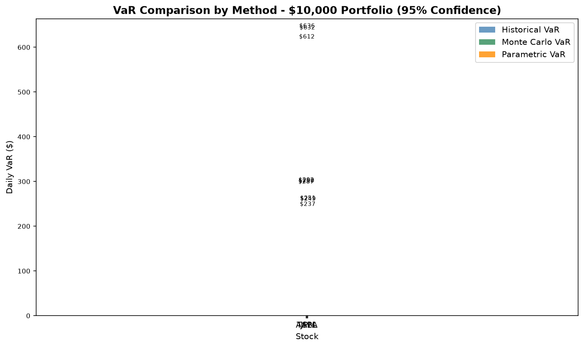
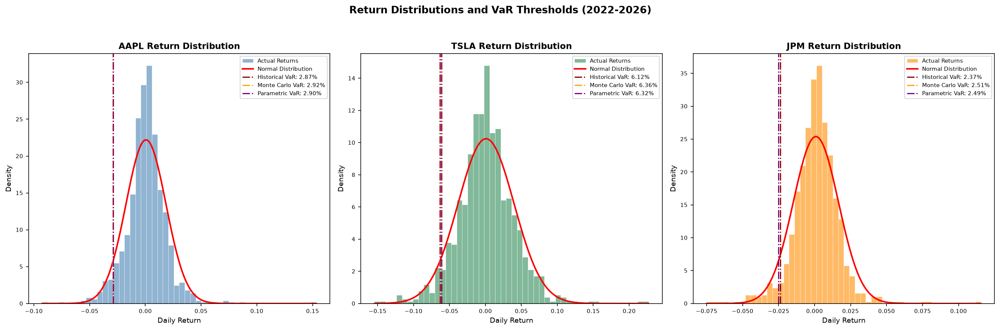
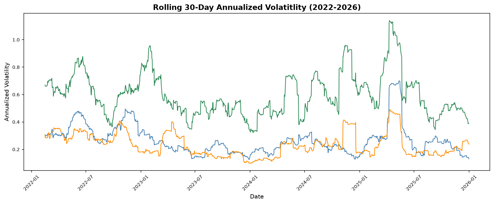
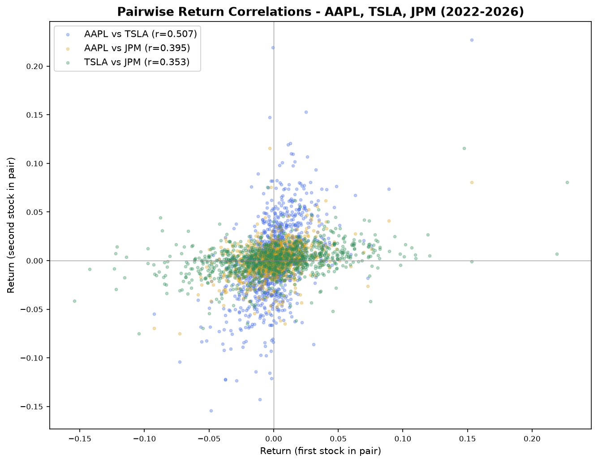

# Value at Risk (VaR) Model — Apple, Tesla, and JPMorgan

This project builds a Value at Risk (VaR) model from scratch using 
real stock market data for three stocks with very different risk 
profiles: Apple (AAPL), Tesla (TSLA), and JPMorgan Chase (JPM). 
It started as a single-stock risk estimate and grew into a more 
complete analysis covering three estimation methods, two rounds of 
backtesting, stress testing, and correlation analysis.

---

## What is Value at Risk?

Value at Risk answers one practical question:

*"If I invest $10,000 in this stock, how much could I lose on a 
bad day — and how confident am I in that estimate?"*

A 95% confidence VaR of $287 means that on 95% of trading days, 
losses on a $10,000 investment won't exceed $287. On the worst 5% 
of days — roughly 12 to 13 days per year — losses are expected to 
exceed that threshold.

---

## Why These Three Stocks?

The three stocks were chosen deliberately to represent three 
different types of risk:

- **Apple (AAPL)** — large-cap tech, relatively stable, 
  one of the most widely held stocks in the world
- **Tesla (TSLA)** — high-growth tech, known for dramatic 
  price swings, heavily driven by company-specific news
- **JPMorgan Chase (JPM)** — one of the largest banks in 
  the world, driven by interest rates, credit markets

Comparing all three shows how the same risk framework behaves 
across different types of assets.

---

## The Three Methods

### 1. Historical VaR
Takes actual past daily returns, sorts them from worst to best, 
and finds the value at the 5th percentile. 

### 2. Monte Carlo VaR
Generates 10,000 simulated daily returns drawn from a normal 
distribution, using each stock's real mean return and standard 
deviation as inputs. The 5th percentile of those simulated 
returns becomes the risk estimate. This method assumes returns 
follow a bell curve.

### 3. Parametric VaR
Calculates VaR directly using a mathematical formula rather than 
simulation. Applies the z-score for 95% confidence (1.645) to 
compute the result in one step, skipping the simulation entirely. 
Added primarily as a cross-validation check — since it uses the 
same normal distribution assumption as Monte Carlo, the two 
results should converge closely.

---

## Results

### Risk Comparison

| Metric | AAPL | TSLA | JPM |
|---|---|---|---|
| Daily Volatility (Std Dev) | 1.80% | 3.89% | 1.57% |
| Historical VaR (95%) | $287.39 | $611.51 | $237.38 |
| Monte Carlo VaR (95%) | $291.54 | $635.79 | $250.90 |
| Parametric VaR (95%) | $289.74 | $631.89 | $249.33 |
| Historical vs MC Gap | $4.16 | $24.28 | $13.53 |

**JPMorgan is the least volatile stock day-to-day** at 1.57% 
standard deviation, even lower than Apple's 1.80%. Its $237.38 
Historical VaR is the lowest of the three, which at first glance 
makes it look like the safest investment. 

**Tesla's gap between Historical and Monte Carlo VaR is the 
largest** — $24.28 compared to $4.16 for Apple and $13.53 for 
JPMorgan. Tesla's volatility is roughly double Apple's, but its 
Historical vs Monte Carlo gap is about six times larger. This 
points to the fat tail problem: volatile stocks have more extreme 
days in reality than a normal distribution predicts. JPMorgan 
sits in the middle, which makes sense — it's more stable than 
Tesla but subject to its own category of tail risk tied to 
financial crises.

---

## Backtesting

### In-Sample Backtest

Tests whether the model correctly predicted breach frequency 
against the same data it was built from.

| Stock | Breaches | Actual Rate | Expected Rate | Result |
|---|---|---|---|---|
| AAPL | 51/1002 | 5.09% | 5.0% | Well-calibrated |
| TSLA | 51/1002 | 5.09% | 5.0% | Well-calibrated |
| JPM | 51/1002 | 5.09% | 5.0% | Well-calibrated |

All three came back almost exactly at 5% — which looks 
reassuring but has a known limitation. Historical VaR is 
defined as the 5th percentile of the same dataset being tested, 
so it will almost always produce a result near 5% by 
construction.

### Out-of-Sample Backtest

Splits the data into two separate windows. The VaR threshold 
is calculated using 2022–2024 data only, then tested against 
2024–2026 data the model has never seen.

| Metric | AAPL | TSLA | JPM |
|---|---|---|---|
| VaR Threshold (training) | -2.91% | -6.36% | -2.50% |
| Testing Days | 396 | 396 | 396 |
| Actual Breach Rate | 4.80% | 3.54% | 4.04% |
| Expected Breach Rate | 5.0% | 5.0% | 5.0% |
| Result | Well-calibrated | Overestimates risk | Well-calibrated |

Apple held up best — its breach rate of 4.80% stayed very 
close to the expected 5%, suggesting Apple's risk profile 
was relatively consistent across both periods.

Tesla overestimated risk — only 3.54% of testing days breached 
the threshold instead of the expected 5%. Its training period 
was turbulent, so a model built on 
that data predicted more extreme days than the comparatively 
calmer 2024–2026 period actually delivered.

JPMorgan was slightly conservative at 4.04% — its 2022 
training period included significant interest rate volatility 
specific to banks, which eased in the testing period.

---

## Stress Testing

VaR describes risk under normal market conditions. Stress 
testing asks what happens during actual crises — applying 
real historical shock scenarios to the portfolio and comparing 
those losses directly to the VaR estimate.

### AAPL (VaR baseline: $287.39)

| Scenario | Shock | Loss | vs VaR |
|---|---|---|---|
| Worst day in dataset (Apr 3, 2025) | -9.2% | $924.56 | 222% worse |
| COVID-19 Crash (Mar 16, 2020) | -12.0% | $1,200.00 | 318% worse |
| 2008 Financial Crisis (Oct 15, 2008) | -9.0% | $900.00 | 213% worse |
| Black Monday (Oct 19, 1987) | -22.6% | $2,260.00 | 686% worse |

Crisis losses range from **2.8x to 7.9x** larger than VaR.

### TSLA (VaR baseline: $611.51)

| Scenario | Shock | Loss | vs VaR |
|---|---|---|---|
| Worst day in dataset (Mar 10, 2025) | -15.4% | $1,542.62 | 152% worse |
| COVID-19 Crash (Mar 16, 2020) | -12.0% | $1,200.00 | 96% worse |
| 2008 Financial Crisis (Oct 15, 2008) | -9.0% | $900.00 | 47% worse |
| Black Monday (Oct 19, 1987) | -22.6% | $2,260.00 | 270% worse |

Crisis losses range from **1.3x to 3.7x** larger than VaR.

### JPM (VaR baseline: $237.38)

| Scenario | Shock | Loss | vs VaR |
|---|---|---|---|
| Worst day in dataset (Apr 4, 2025) | -7.5% | $748.38 | 215% worse |
| COVID-19 Crash (Mar 16, 2020) | -12.0% | $1,200.00 | 406% worse |
| 2008 Financial Crisis (Oct 15, 2008) | -9.0% | $900.00 | 279% worse |
| Black Monday (Oct 19, 1987) | -22.6% | $2,260.00 | 852% worse |

Crisis losses range from **3.4x to 9.5x** larger than VaR.

---

## Correlation Analysis

| Pair | Correlation |
|---|---|
| AAPL vs TSLA | 0.507 |
| AAPL vs JPM | 0.395 |
| TSLA vs JPM | 0.353 |

The two tech stocks are most correlated with each other 
(0.507), while JPMorgan shows lower correlations with both 
Apple (0.395) and Tesla (0.353). This makes sense — Apple 
and Tesla are both driven by Nasdaq sentiment, interest 
rate sensitivity for growth stocks, and tech sector trends. 
JPMorgan moves on fundamentally different factors: interest 
rate spreads, loan performance, and financial system health.

From a portfolio perspective, adding JPMorgan provides more 
genuine diversification than adding a second tech stock 
would. During the 2022 rate hike cycle, rising rates hurt 
Apple and Tesla's valuations while simultaneously benefiting 
JPMorgan's net interest margins — exactly the kind of 
partial hedge that lower correlation represents in practice.

---

## Volatility Over Time

The rolling 30-day volatility chart shows how each stock's 
risk changed over the four-year period rather than treating 
it as constant. Key observations:

- Tesla's volatility was consistently the highest throughout, 
  with dramatic swings between calm and turbulent periods
- Apple and JPMorgan showed more stable, lower volatility 
  profiles across most of the period
- All three stocks spiked sharply in early 2025 during the 
  tariff-driven market selloff — the same period that 
  produced each stock's worst single day in the dataset
- JPMorgan's volatility was notably low and stable for most 
  of the period, which makes the stress test finding even 
  more striking — calm daily behavior masked significant 
  vulnerability to crisis scenarios

---

## Return Distribution Analysis

Overlaying a theoretical normal curve on each stock's actual 
return histogram makes the fat tail problem visually clear. 
In the tails of each chart — the far left and right edges 
where extreme days live — the histogram bars extend above 
the normal curve. Real extreme days happen more often than 
a bell curve predicts.

This effect is most pronounced for Tesla, consistent with 
its larger Historical vs Monte Carlo VaR gap ($24.28 versus 
$4.16 for Apple and $13.53 for JPMorgan). The more a stock 
deviates from normal distribution behavior, the less 
reliable any model built on that assumption becomes.

---

## Limitations

- VaR identifies the loss threshold but says nothing about 
  how large losses get beyond it. Conditional VaR (CVaR) 
  addresses this by measuring the average loss on the days 
  VaR is actually breached
- Monte Carlo and Parametric VaR both assume normally 
  distributed returns, which underestimates tail risk — 
  the fat tail charts make this visible
- The in-sample backtest is somewhat circular and should 
  always be read alongside the out-of-sample results
- The model currently treats each stock independently 
  and does not account for the correlation effects between 
  them in a combined portfolio — the next planned extension

---

## What I Plan to Build Next

- **Multi-asset portfolio VaR** using a covariance matrix 
  to formally model how the three pairwise correlations 
  (0.507, 0.395, 0.353) reduce combined portfolio risk
- **Student's t-distribution** in Monte Carlo to better 
  capture fat tails instead of assuming a normal distribution
- **Conditional VaR (CVaR)** to measure the average 
  severity of losses on the days VaR is breached, not 
  just the threshold itself
- **Rolling-window VaR** so the model adapts to changing 
  market conditions rather than assuming constant volatility

---

## Tools Used

- Python 3.14
- yfinance — real stock price data from Yahoo Finance
- pandas — data handling and processing
- NumPy — math and simulation
- matplotlib — all charts and visualizations
- scipy — statistical functions including the normal 
  distribution and z-scores
- Git and GitHub — version control and project hosting
---
## Visualizations

### VaR Method Comparison

### Return Distributions with Normal Curve Overlay

### Rolling 30-Day Volatility

### Pairwise Return Correlations

