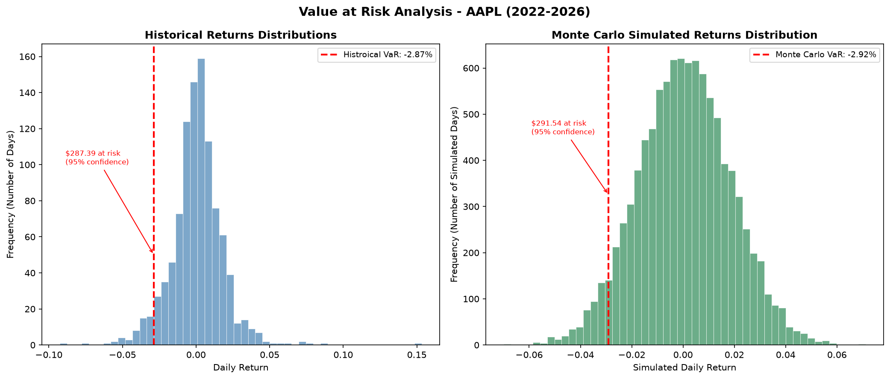

# Value at Risk (VaR) Model — Apple Inc. (AAPL)

## Overview
This project builds a Value at Risk (VaR) model in Python to estimate 
the daily risk of a $10,000 investment in Apple stock (AAPL) using 
four years of real market data (2022–2026). Two methods are compared: 
Historical Simulation and Monte Carlo Simulation.

## What is Value at Risk?
Value at Risk answers the question: "How much could this investment 
lose on a bad day, and how confident are we in that estimate?"

A 95% confidence VaR of $287 means: on 95% of trading days, losses 
will not exceed $287. On the worst 5% of days — roughly 12–13 days 
per year — losses could exceed that threshold.

## Methodology

### Historical VaR
Uses 1,002 days of real Apple returns (2022–2026) to find the actual 
5th percentile of historical daily losses. No distributional assumptions 
are made — the model uses what actually happened.

### Monte Carlo VaR
Generates 10,000 simulated daily returns drawn from a normal distribution 
parameterized by Apple's real mean return (0.06%) and standard deviation 
(1.80%). Finds the 5th percentile of the simulated distribution.

## Results

| Method | Daily VaR | Dollar Amount (95% confidence) |
|---|---|---
| Historical Simulation | -2.87% | $287.39 |
| Monte Carlo Simulation | -2.92% | $291.54 |
| Difference | 0.05% | $4.15 |

## Key Insight
The two methods produced nearly identical estimates — a difference of 
only $4.15 on a $10,000 portfolio — suggesting the normal distribution 
is a reasonable approximation of Apple's return behavior over this period. 
Notably, Monte Carlo VaR was slightly higher than Historical VaR, indicating 
the normal distribution marginally overestimated tail risk compared to what 
actually occurred. This is the reverse of the fat tail phenomenon commonly 
observed in equity returns, where extreme losses occur more frequently than 
a normal distribution predicts — a finding worth investigating across 
different stocks and time periods.

## Limitations
- VaR does not predict the magnitude of losses beyond the threshold
- The Monte Carlo model assumes normally distributed returns, which 
  may underestimate tail risk in more volatile stocks or crisis periods
- Historical VaR is limited by the specific market conditions in the 
  sample period

## Technologies Used
- Python 3.14
- yfinance — real market data
- NumPy — numerical computation and simulation
- pandas — data manipulation
- matplotlib — visualization
- scipy — statistical functions

## Visualization

