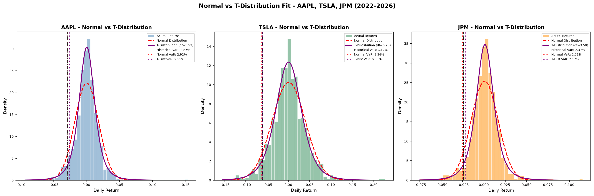

# Value at Risk (VaR) Model — Apple, Tesla, and JPMorgan

This project builds a Value at Risk (VaR) model from scratch using 
real stock market data for three stocks with very different risk 
profiles: Apple (AAPL), Tesla (TSLA), and JPMorgan Chase (JPM). It 
started as a single-stock risk estimate and grew into a complete 
analysis covering four estimation methods, two rounds of 
backtesting, stress testing, distribution fitting, and correlation 
analysis. 

---

## What is Value at Risk?

Value at Risk answers one practical question:

*"If I invest $10,000 in this stock, how much could I lose on a 
bad day — and how confident am I in that estimate?"*

A 95% confidence VaR of $287 means that on 95% of trading days, 
losses on a $10,000 investment won't exceed $287. On the worst 5% 
of days — roughly 12 to 13 days per year — losses are expected to 
exceed that threshold.

---

## Why These Three Stocks?

The three stocks were chosen to represent genuinely different types 
of risk:

- **Apple (AAPL)** — large-cap tech, relatively stable, one of 
  the most widely held stocks in the world
- **Tesla (TSLA)** — high-growth tech, known for dramatic price 
  swings driven heavily by company-specific news
- **JPMorgan Chase (JPM)** — one of the largest banks in the 
  world, driven by interest rates and financial system health 

Comparing all three shows how the same risk framework behaves across 
different asset types.

---

## The Four Methods

### 1. Historical VaR
Uses actual past daily returns to find the 5th percentile of 
historical losses. What happened over the four-year sample period (2022–2026).

### 2. Monte Carlo VaR (Normal Distribution)
Generates 10,000 simulated daily returns drawn from a normal 
distribution, using each stock's real mean and standard deviation. 
The 5th percentile of those simulated returns becomes the risk 
estimate.

### 3. Parametric VaR
Calculates VaR using a direct formula instead of simulation, applying 
the z-score for 95% confidence (1.645). Added mainly as a 
cross-validation check.

### 4. Monte Carlo VaR (T-Distribution)
The normal distribution assumes extreme days are rare. A t-distribution has heavier tails, 
controlled by a parameter called degrees of freedom — lower values mean fatter 
tails and more extreme-event probability.

---

## Results

### Risk Comparison

| Metric | AAPL | TSLA | JPM |
|---|---|---|---|
| Daily Volatility | 1.80% | 3.89% | 1.57% |
| Historical VaR (95%) | $287.39 | $611.51 | $237.38 |
| Monte Carlo VaR (Normal) | $291.54 | $635.79 | $250.90 |
| Parametric VaR | $289.74 | $631.89 | $249.33 |
| Monte Carlo VaR (T-Dist) | $255.26 | $607.99 | $216.68 |
| Degrees of Freedom (t-dist) | 3.53 | 5.25 | 3.58 |

JPMorgan is the least volatile of the three day-to-day, with the 
lowest VaR across every method. 

All three degrees of freedom values are well below 10, meaning all 
three stocks have noticeably fatter tails than a normal distribution 
would predict.

The t-distribution VaR came out **lower** than the normal distribution VaR 
for every stock at 95% confidence. 

---

## Backtesting

### In-Sample Backtest

Checks whether the model's predicted breach rate matches what 
actually happened in the same data it was built from.

| Stock | Breaches | Actual Rate | Expected Rate | Result |
|---|---|---|---|---|
| AAPL | 51/1002 | 5.09% | 5.0% | Well-calibrated |
| TSLA | 51/1002 | 5.09% | 5.0% | Well-calibrated |
| JPM | 51/1002 | 5.09% | 5.0% | Well-calibrated |

All three landed almost exactly at 5%. This test has a known 
limitation though — Historical VaR is defined as the 5th percentile 
of the same data being tested, so it's expected to land near 5% by 
construction.

### Out-of-Sample Backtest

Splits the data into two windows. I used 2022–2024 to calculate the 
VaR threshold, then tested that threshold against 2024–2026 data the 
model had never seen.

| Metric | AAPL | TSLA | JPM |
|---|---|---|---|
| VaR Threshold (training) | -2.91% | -6.36% | -2.50% |
| Testing Days | 396 | 396 | 396 |
| Actual Breach Rate | 4.80% | 3.54% | 4.04% |
| Expected Breach Rate | 5.0% | 5.0% | 5.0% |
| Result | Well-calibrated | Overestimates risk | Well-calibrated |

Apple held up best out-of-sample. Tesla overestimated risk — its 
training period (especially 2022) was unusually turbulent, so the 
model expected more bad days than the calmer 2024–2026 period 
actually delivered. JPMorgan was slightly conservative, which fits 
with 2022 being a difficult year for bank stocks specifically due to 
aggressive interest rate hikes.

---

## Stress Testing

### AAPL (VaR baseline: $287.39)

| Scenario | Shock | Loss | vs VaR |
|---|---|---|---|
| Worst day in dataset (Apr 3, 2025) | -9.2% | $924.56 | 222% worse |
| COVID-19 Crash (Mar 16, 2020) | -12.0% | $1,200.00 | 318% worse |
| 2008 Financial Crisis (Oct 15, 2008) | -9.0% | $900.00 | 213% worse |
| Black Monday (Oct 19, 1987) | -22.6% | $2,260.00 | 686% worse |

### TSLA (VaR baseline: $611.51)

| Scenario | Shock | Loss | vs VaR |
|---|---|---|---|
| Worst day in dataset (Mar 10, 2025) | -15.4% | $1,542.62 | 152% worse |
| COVID-19 Crash (Mar 16, 2020) | -12.0% | $1,200.00 | 96% worse |
| 2008 Financial Crisis (Oct 15, 2008) | -9.0% | $900.00 | 47% worse |
| Black Monday (Oct 19, 1987) | -22.6% | $2,260.00 | 270% worse |

### JPM (VaR baseline: $237.38)

| Scenario | Shock | Loss | vs VaR |
|---|---|---|---|
| Worst day in dataset (Apr 4, 2025) | -7.5% | $748.38 | 215% worse |
| COVID-19 Crash (Mar 16, 2020) | -12.0% | $1,200.00 | 406% worse |
| 2008 Financial Crisis (Oct 15, 2008) | -9.0% | $900.00 | 279% worse |
| Black Monday (Oct 19, 1987) | -22.6% | $2,260.00 | 852% worse |

### The Most Important Finding

JPMorgan had the lowest day-to-day VaR of the three stocks, but the 
worst stress test results. The Black Monday scenario produces losses 
852% worse than its VaR estimate, compared to 686% for Apple and 
270% for Tesla.

Main takeaway: **low day-to-day volatility does not mean low tail risk.** 
JPMorgan's biggest risks are tied to financial system stress — banking crises, credit defaults, 
liquidity shocks — events that don't show up in calm daily returns 
but hit hard during systemic failures. The 2008 scenario matters 
most here since it was specifically a banking crisis. 

---

## Correlation Analysis

| Pair | Correlation |
|---|---|
| AAPL vs TSLA | 0.507 |
| AAPL vs JPM | 0.395 |
| TSLA vs JPM | 0.353 |

The two tech stocks are most correlated with each other, while 
JPMorgan moves more independently from both. During the 2022 rate hike cycle, 
rising rates hurt Apple and Tesla's valuations while actually helping 
JPMorgan's net interest income.

---

## Limitations

- VaR identifies a loss threshold but says nothing about how bad 
  losses get beyond it. Conditional VaR (CVaR) would measure the 
  average loss on the days VaR is actually breached
- The t-distribution comparison was only run at 95% confidence — 
  the fat-tail advantage would likely be clearer at 99% or higher
- The in-sample backtest is somewhat circular by construction and 
  should always be read next to the out-of-sample results
- The model treats each stock independently and doesn't yet account 
  for the correlation effects in a real combined portfolio

---

## Next Steps

- Multi-asset portfolio VaR using a covariance matrix, built on the 
  three correlation numbers above
- A confidence level comparison (90%, 95%, 99%, 99.9%) to directly 
  show where the t-distribution's fat-tail advantage becomes visible
- Conditional VaR (CVaR) to measure severity, not just threshold

---

## How to Run

1. Clone the repository
2. Install dependencies:
   pip install yfinance pandas numpy matplotlib scipy
3. Run the model:
   var_model.py
4. Charts save automatically to the project folder

---

## Tools Used

- Python 3.14
- yfinance — real stock price data from Yahoo Finance
- pandas — data handling and processing
- NumPy — math and simulation
- matplotlib — all charts and visualizations
- scipy — statistical functions, including the normal and 
  t-distributions
- Git and GitHub — version control and project hosting

---

## Visualizations

### VaR Method Comparison

### Return Distributions with VaR Thresholds

### Normal vs T-Distribution Fit

### Rolling 30-Day Volatility

### Pairwise Return Correlations

